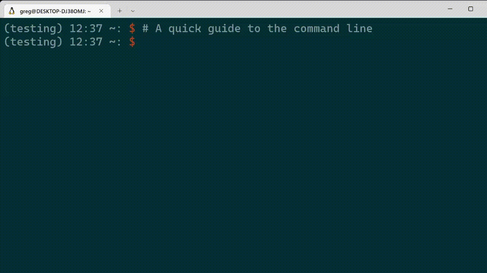

## Step 2: The command line

If you are using Ubuntu through WSL and finished step 1, or on Ubuntu (directly) or a Mac, you now need a learn how to use the command line. The command line is a user interface which uses text instead of a mouse.

1. To open the command line search for the "terminal" app on Windows, press `ctrl+alt+t` on Ubuntu, or follow [these instructions](https://support.apple.com/en-gb/guide/terminal/apd5265185d-f365-44cb-8b09-71a064a42125/mac) for a Mac.
2. There are many cheat sheets online on the full set of commands available, see [this one for example](https://www.git-tower.com/blog/command-line-cheat-sheet/)
3. To get you started, take a look at the following video which contains the commands you'll need for this project:
<p align="center">

</p>

> **_NOTE:_**  TO copy and paste into the terminal, you may need to use `CTRL+Shift+C` and `CTRL+Shift+V` (these settings can be adjusted).

In the following (and elsewhere in these documents), commands that should be run in the command line (or terminal) are pre-pended by "$", for example
```console
$ pwd
```
while commands run in a python terminal will use ">>>":
```python
>>> print("Hello world")
```
Where it is relevant, we will add the conda environment (see below), e.g. `(base) $ pwd`.
